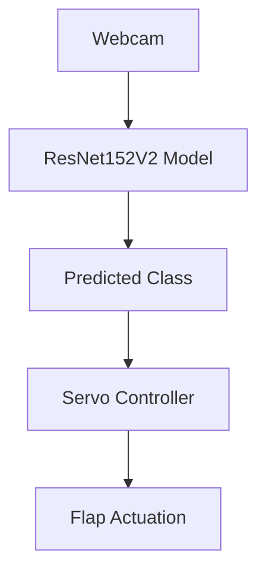

Here's a more professional, clean, and well-organized version of your GitHub README for the **AI-powered Waste Segregation** project:

---

# ♻️ AI-powered Waste Segregation

An end-to-end, AI-driven waste segregation system combining deep learning with physical sorting mechanisms. This project utilizes a fine-tuned ResNet model to classify waste in real time and directs servo-controlled flaps to sort the waste accordingly. Ideal for smart bins, recycling centers, research, and educational purposes.

---

## 📑 Table of Contents
- [Overview](#overview)
- [Features](#features)
- [System Architecture](#system-architecture)
- [Repository Structure](#repository-structure)
- [Installation](#installation)
- [Usage Guide](#usage-guide)
- [Applications](#applications)
- [Contributing](#contributing)
- [License](#license)

---

## 🧠 Overview

This project leverages computer vision and hardware control to automate waste segregation. It consists of three core modules:

1. **Model Training & Fine-Tuning**  
   A ResNet-based CNN is trained to classify waste into *organic*, *recyclable*, and *non-recyclable* categories.
   
2. **Real-Time Classification**  
   The trained model is integrated with a webcam to perform live predictions.

3. **Physical Sorting**  
   Based on predictions, servo motors actuate flaps to route waste into designated bins.

---

## 🚀 Features

- ✅ **Fine-tuned ResNet152V2** model for image-based waste classification  
- 📷 **Live webcam integration** for real-time predictions  
- ⚙️ **Servo-based sorting system** for physical waste separation  
- 📊 Visualization tools for training metrics and confusion matrices  
- 🔌 **Modular design** for training, inference, and hardware control  

---

## 🛠️ System Architecture



---

## 📁 Repository Structure

| File/Folder                          | Description                                                                 |
|--------------------------------------|-----------------------------------------------------------------------------|
| `Fine Tuning the Resnet model.ipynb` | Jupyter notebook for data preprocessing, training, and model evaluation    |
| `Webcam integration.ipynb`           | Real-time classification via webcam and trained model                      |
| `servo_motor_control.py`             | (To be uploaded) Controls servo motors based on model predictions          |
| `Simulation of Waste Segregator.mp4` | Video demo showcasing the entire system in action                          |
| `Demonstration of running waste classifier AI.mp4` | Video demo showcasing the AI classifying different kinds of waste          |
| `LICENSE`                            | MIT License                                                                 |

---

## ⚙️ Installation

### ✅ Prerequisites
- Python 3.7+
- Jupyter Notebook
- Hardware: Raspberry Pi (or compatible), GPIO-compatible servo motors

### 📦 Required Libraries

Install dependencies using pip:

```bash
pip install -r requirements.txt
```

> _Tip: Create the `requirements.txt` file based on all imports used in the codebase._

### 🔧 Clone the Repository

```bash
git clone https://github.com/yourusername/AI-powered-waste-segregation.git
cd AI-powered-waste-segregation
```

---

## 🧪 Usage Guide

### 🔬 Model Training
1. Prepare the dataset in the defined directory structure.
2. Run `Fine Tuning the Resnet model.ipynb` to:
   - Load and augment data
   - Train and evaluate the ResNet model
   - Save the best model as `best_model_resnet152v2.keras`

### 🔍 Real-Time Classification
1. Update the model path in `Webcam integration.ipynb`.
2. Execute the notebook to launch the live classification system.

### 🤖 Servo Motor Sorting
1. Connect the servo motors as per GPIO pin configurations (details will be in `servo_motor_control.py`).
2. Run the script to:
   - Test flap movements
   - Automatically trigger sorting based on classification results

---

## 🌍 Applications

- **Smart Bins**: Automate in-house or public waste sorting.
- **Recycling Plants**: Increase efficiency and reduce manual labor.
- **Academic Projects**: Combine AI and robotics for impactful innovation.
- **Research**: Use as a baseline for developing smart waste management systems.

---

## 🤝 Contributing

We welcome contributions! Feel free to:
- Open issues
- Suggest features
- Submit pull requests

Please ensure your changes follow the existing code style and include appropriate documentation.

---

## 📄 License

This project is licensed under the MIT License. See [LICENSE](./LICENSE) for more information.

---

> 🧩 _Empowering sustainable waste management with AI and robotics._

---

Let me know if you'd like a `requirements.txt` autogenerated or help uploading the `servo_motor_control.py` file!
